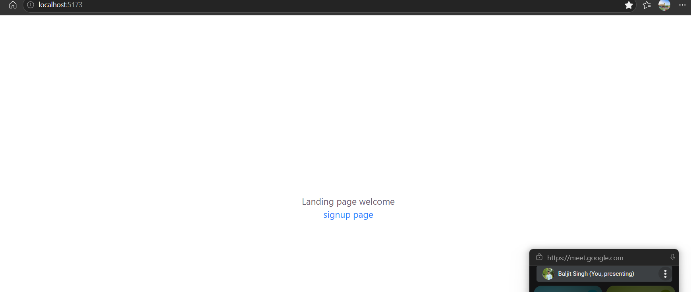
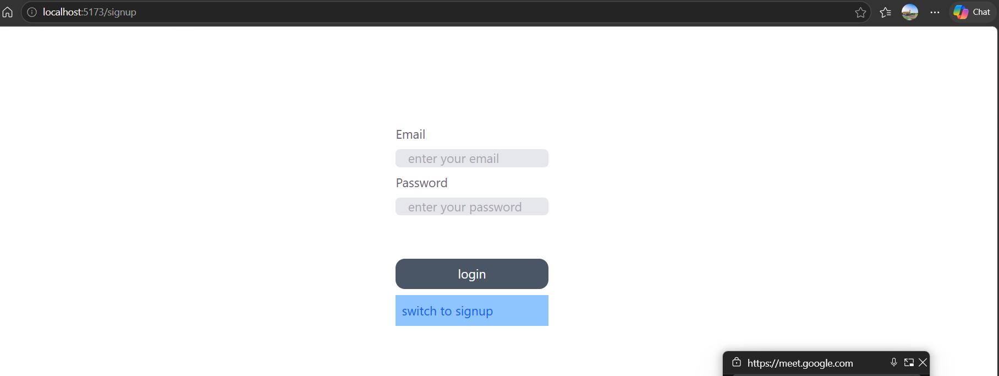
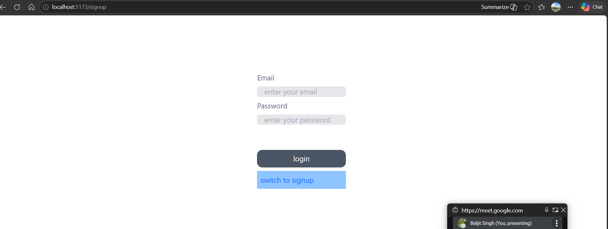
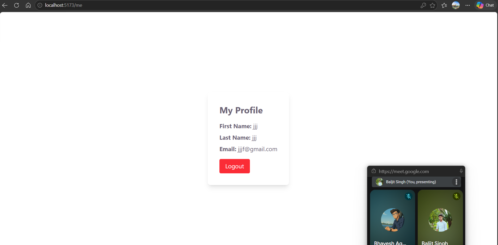

there is two folder frontend and server, 
for the frontend in env using this one : VITE_BACKEND_URL= 'http://localhost:3000'

and for the backend used this on: DB_URI=""mongodb://localhost:27017/testdb""
JWT_SECRET="secret";

just use the npm i and start seprately seprately, and use it, make sure use use your own localmongodb
- feature
you will get this first page where you will be see link signup, 
click on the signup, and thend signup by filling the form,
afte that clik on the login, login using your credntials,
there is /my page which is protected after loggin in you will be able to see it.

here is some snamshorts:

singup page:

login page: 
protected route /me:

